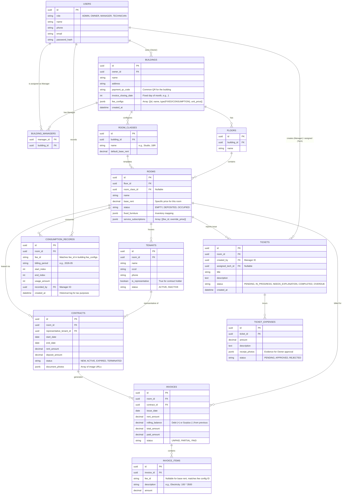

# Entity-Relationship Diagram (ERD) - 29LAND

Based on the operations management requirements for 29LAND, here is the Database Entity-Relationship design. 

## 1. Mermaid ER Diagram

## 2. Key Domain Concepts Explained

### User & Access Management
- **`USERS`**: A single table handling all roles (`ADMIN`, `OWNER`, `MANAGER`, `TECHNICIAN`). 
- **`BUILDING_MANAGERS`**: A pivot table resolving the Many-to-Many relationship since a Manager can manage multiple buildings across different Owners, ensuring data isolation.

### Assets & Tenancy
- **Hierarchy**: `BUILDINGS` ➔ `FLOORS` ➔ `ROOMS`. 
- **Room Pricing**: `ROOM_CLASSES` acts as a template for prices in a building. However, each `ROOMS` record stores its own `base_rent` directly, allowing users to apply the config class but still input a specific room price independently. Invoices will strictly pull this `base_rent` to calculate bills.
- **`TENANTS`**: Everyone living in the room is logged here for temporary residence registration. However, only **one** tenant is marked as `is_representative = true`.
- **`CONTRACTS`**: Tied directly to the representative tenant and the room. Handover photos are stored directly in `document_photos`.

### Billing & Invoices
- **`fee_configs` & `service_subscriptions` (JSONB)**: To maximize flexibility, buildings define their fee dictionary in `BUILDINGS.fee_configs`. Each room then maintains an array of `service_subscriptions` within `ROOMS` mapping to those fees, allowing easy opt-outs or price overrides without complex relational tables.
- **`CONSUMPTION_RECORDS`**: Tracks the start and end indices of any consumption-based fee (electricity, water, etc.) for each room mapping to a specific JSON `fee_id`. A permanent history is maintained for tax declaration.
- **`INVOICES` & `INVOICE_ITEMS`**: Invoices are dynamically generated. Fixed costs are auto-added based on the room's subscriptions, and consumption costs are calculated from records. Line items (`INVOICE_ITEMS`) store the exact breakdown.
    - `rolling_balance`: Handles over-payment or under-payment, rolling over to the next invoice.

### Maintenance & Ticketing
- **`TICKETS`**: Managed primarily by Manager and assigned to Technician. Tracks the lifecycle of the maintenance task.
- **`TICKET_EXPENSES`**: Separated from the ticket itself so that a single ticket can have multiple expense claims (materials bought). If an expense is `REJECTED` by the Owner, the parent ticket state shifts to `NEEDS_EXPLANATION`.
